# Java

- [생활코딩](https://www.youtube.com/watch?v=qR90tdW0Hbo&list=PLuHgQVnccGMCeAy-2-llhw3nWoQKUvQck&index=2)

- [동빈나](https://www.youtube.com/watch?v=wjLwmWyItWI&list=PLRx0vPvlEmdBjfCADjCc41aD4G0bmdl4R)

---

### 왜 Java를 학습해야 하는가?

- 한국에서는 정부나 기업의 시스템 통합 프로젝트가 대부분 자바로 구현됨

- 자바는 기업용 시장에서 두각을 나타내고 있다.

- SI - 시스템 통합
  
  - System Integration
  
  - 기관이나 기업의 업무 관리를 소프트웨어화하는 것을 의미한다.
  
  - 제조 공정의 경우 생산설비의 상태를 시스템적으로 관리

- 자바 언어에대한 학습 자료가 매우 풍부함 - 1995년 시작

- 국내에서 자바는 가장 시장 규모가 큰 언어입니다.
  
  - 기업용 시장에서 전통적인 강자
  
  - 안드로이드가 주류가 되면서 다시 한 번 그 중요성이 커짐
  
  - JSP (웹 에플리케이션), 안드로이드

---

### Java 용어

- Java SE
  
  - Java Platform Standard Edition 자바 표준안
  
  - 이 명세서에 따라서 Java가 만들어지게 된다.

- JCP
  
  - Java Community Process
  
  - JCP는 Java 기술에 대한 표준 기술 사양을 개발하기 위한 메커니즘, 조직

- JDK
  
  - Java Development Kit
  
  - Java SE의 표준안에 따라서 만들어진 소프트웨어
  
  - 컴파일러, 개발에 필요한 각종도구, JRE가 포함되어 있음
  
  - **개발자**를 위한 자바 버전
  
  - 3가지 분류가 있음
    
    - Java SE
    
    - Java EE - 기업용
    
    - Java Me - 모바일

- JRE
  
  - Java Runtime Environment
  
  - 자바가 실제로 동작하는데 필요한 JVM, 라이브러리, 각종 파일들이 포함되어 있음
  
  - **일반 사용자**가 자바로 만들어진 프로그램을 구동하려고 한다면 JRE가 필요함

- JVM
  
  - Java Virtual Machine
  
  - 자바로 만들어진 소프트웨어가 가상화된 환경에서 구동됨
  
  - 하드웨어나 운영체제에 따라서 달라질 수 있는 호환성의 문제는 JVM이 알아서 해결
  
  - 즉, 자바 프로그램이 어떤 환경에서도 실행할 수 있도록 하는 것이 JVM의 역할

---

### Java 설치

- 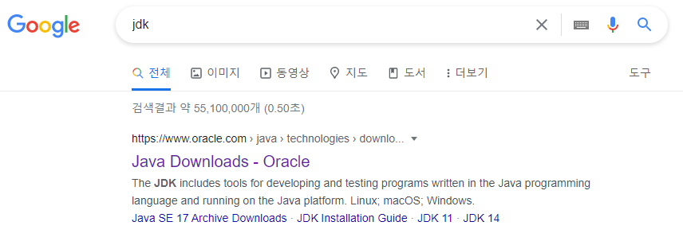

- 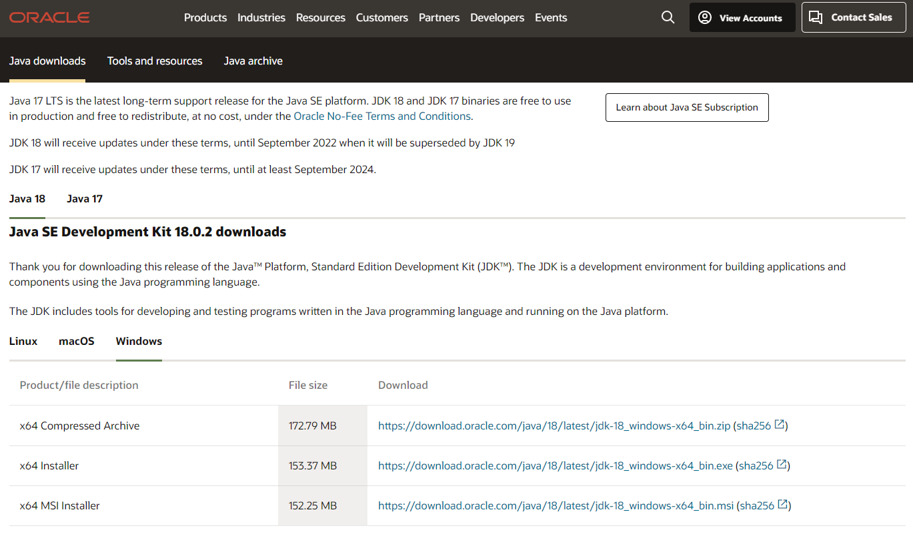

- 원래는 이후에 환경변수 설정을 통해서 javac (컴파일 프로그램)이 있는 경로(C:\Program Files\Java\jdk-18.0.2\bin) 를 환경변수 path에 추가해 주어야하는데 최근 버전은 이러한 작업을 설치시 자동으로 해주는 것 같습니다.

---

### Java 실행

- 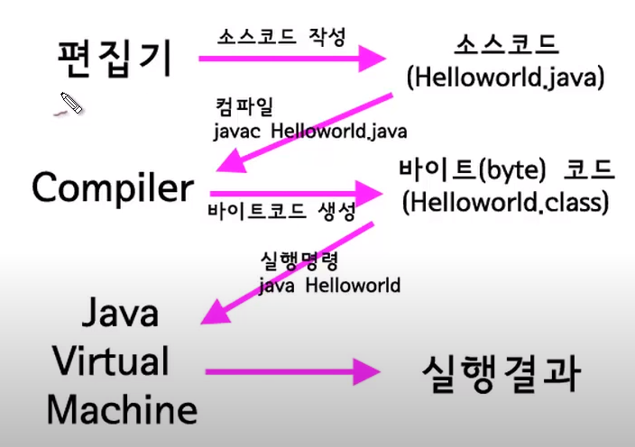

- ```bash
  $ touch Helloworld.java
  ```
  
  - 파일 생성 후 메모장으로 실행!

- ```java
  class Helloworld {
      public static void main(String[] args){
          System.out.println("Hello World");
      }
  }
  ```
  
  - 내용 입력 후 저장
  
  - 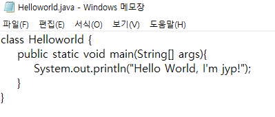

- ```bash
  $ javac Helloworld.java
  ```
  
  - 해당 명령어를 실행하면 컴파일 해서 바이트 코드 생성
  
  - Helloworld.class 가 생성됨

- ```bash
  $ java Helloworld
  ```
  
  - bash창에 결과가 출력됨
  
  - 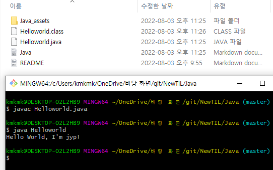

---

### 이클립스 설치

- 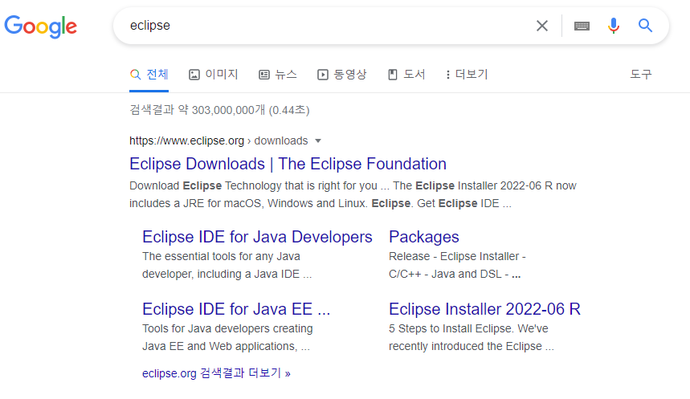

- 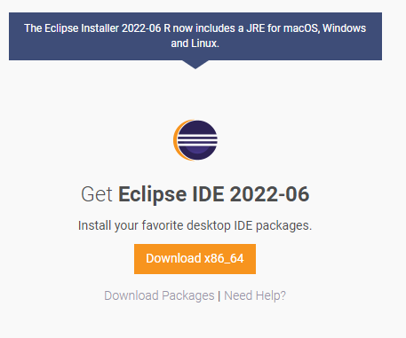

- 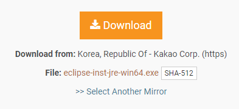

- 

- 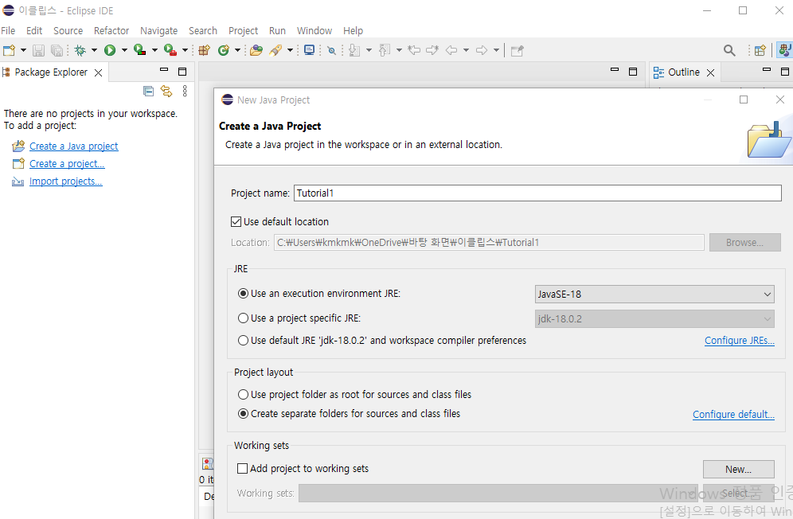

- 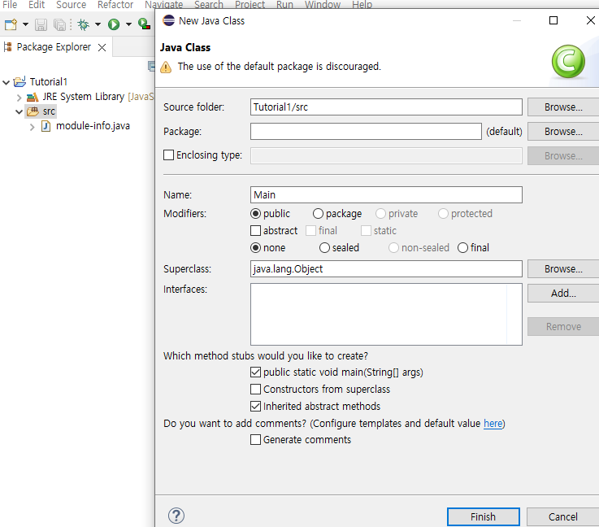

- 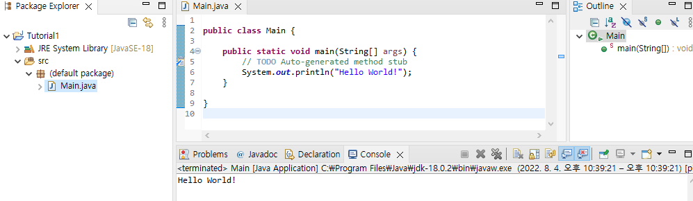

---

### 변수

- 변수
  
  - Variable
  
  - 프로그램이 실행되는 동안에 언제든지 저장된 값이 변경될 수 있는 공간을 의미함
  
  - 물건을 담았다가 뺄 수 있는 열린 상자

- 상수
  
  - Constant
  
  - 한 번 정해지면 값을 변경할 필요가 없는 데이터를 의미함
  
  - 한 번 담으면 물건을 바꾸지 못하는 포장된 상자

- 변수 실습
  
  - ```java
    public class Main {
    
        // 상수 선언
        final static double PI = 3.141592;
    
        public static void main(String[] args) {
    
            // 여러가지 자료형 변수 실습
            int intType = 100;
            double doubleType = 150.5;
            String stringType = "jyp";
    
            System.out.println(intType);
            System.out.println(doubleType);
            System.out.println(stringType);
    
            // 상수 활용
            int r = 30;
            double area = r * r * PI;
            System.out.println(area);
            r = 20;
            System.out.println(area);
            area = r * r * PI;
            System.out.println(area);
    
            // 오버플로우 실습
            System.out.println(1000000000 * 10);
            System.out.println(2147483647 + Math.abs(-2147483648) + 1);
            System.out.println(Math.pow(3, 20));
            System.out.println((int) Math.pow(3, 20));
            System.out.println((int) Math.pow(3, 20) + 1);
        }
    
    }
    ```
  
  - ```
    100
    150.5
    jyp
    2827.4328
    2827.4328
    1256.6368
    1410065408
    0
    3.486784401E9
    2147483647
    -2147483648
    ```
  
  - 여러자료형 변수에 값을 담아보고 출력해보자!
  
  - final static 을 통해 상수를 정의하고 활용해보자!
  
  - int 자료형의 최대값을 확인하고 최대값을 넘어가는 계산을 하면 어떻게 되는지 확인하자, 오버플로우의 이해
  
  - " - 2,147,483,648 ~ 2,147,483,647"
    
    - 32비트 중 1비트는 음수 양수 부호 비트
    
    - 나머지 31 비트가 숫자 부
    
    - 2^31 = 2,147,483,648
    
    - 양수부 = 0 ~ 2,147,483,647
    
    - 음수부 = -2,147,483,648 ~ -1
  
  - System.out.println(10000000000);
    
    - ```
      Exception in thread "main" java.lang.Error: Unresolved compilation problem: 
          The literal 10000000000 of type int is out of range 
      
          at Main.main(Main.java:28)
      ```
  
  - System.out.println(1000000000 * 10);
    
    - 1410065408
    
    - 10,000,000,000이 아닌, 1,410,065,408 이 출력됨
    
    - 왜?
    
    - ```
      System.out.println(2147483647 + abs(-2147483648) + 1);
      => 0 이 출력됨을 확인 가능
      
      2 * ( 2147483647 + abs(-2147483648) + 1 ) + 1410065408
      == 10,000,000,000
      ```
    
    - 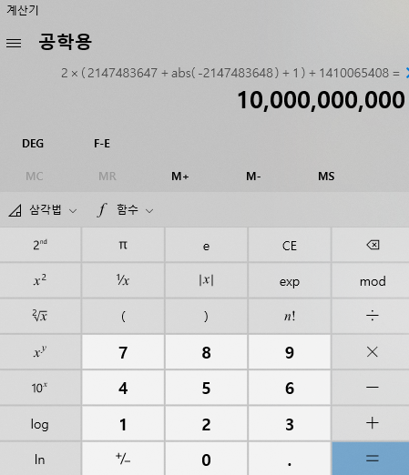

---

### 이클립스 설정

- 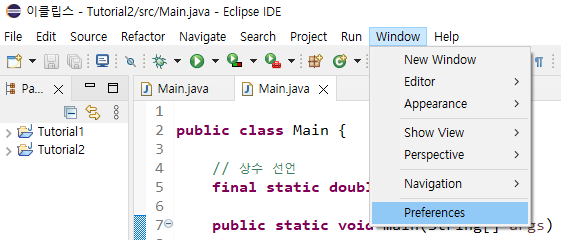
  
  - window 탭 - Preferences

- 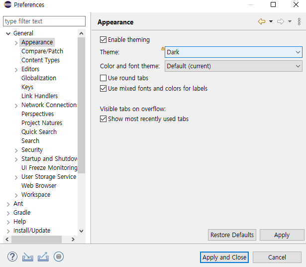
  
  - General - Appearance
  
  - Theme - Dark - Apply and Close

- 코드 창에서 Ctrl 버튼과 '+' or '-' 버튼을 함께 눌러서 화면상에 보이는 글자의 크기를 조절할 수 있다.

---

### 사칙연산

- ```java
  public class Main {
  
  	public static void main(String[] args) {
  		int a = 1;
  		int b = 2;
  		
  		System.out.println("a + b = " + (a + b));
  		System.out.print("a - b =");
  		System.out.print(a - b + "\n");
  		System.out.printf("a / b = %d \n", a/b);
  		System.out.println("a * b = " + a * b);
  		
  		double c = 1.0;
  		float d = 3.0f;
  		int e = 1;
  		
  		System.out.println("c / d = " + c/d);
  		System.out.println("e / d = " + e/d);
  		
  		double f = 3e6;
  		float g = 3e5f;
  		double h = 2e-3;
  		
  		System.out.println("3e6 = " + f);
  		System.out.println("3e5f = " + g);
  		System.out.println("2e-3 = " + h);
  	}
  }
  
  ```

- ```
  a + b = 3
  a - b =-1
  a / b = 0 
  a * b = 2
  c / d = 0.3333333333333333
  e / d = 0.33333334
  3e6 = 3000000.0
  3e5f = 300000.0
  2e-3 = 0.002
  ```

- println(문자형  + 정수형)

- print "\n" 을 쓰면 println 처럼 쓸 수 있다.

- printf  %d - 정수, %f - 실수, %c- 문자, %s - 문자열

- int float, double / 32비트,  32비트, 64비트

- 나누기 연산시
  
  - double / float = double
  
  - int / float = float

- a e b = a * 10^b

---
